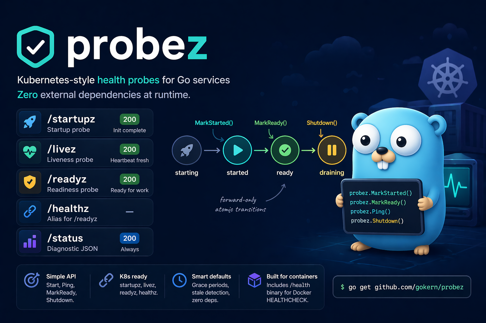

# `probez`: Kubernetes-style health probes for Go services

[](https://github.com/gokern/probez/actions/workflows/ci.yml)
[](https://github.com/gokern/probez/actions/workflows/lint.yml)
[](https://github.com/gokern/probez/actions/workflows/codeql.yml)
[](https://pkg.go.dev/github.com/gokern/probez)
[](https://goreportcard.com/report/github.com/gokern/probez)
[](go.mod)
[](https://github.com/gokern/probez/releases)
[](LICENSE)

<p align="center">
  
</p>

Every long-running service eventually needs the same four endpoints: "did you start?", "are you alive?", "are you ready?", and "what's going on in there?". `probez` gives you those endpoints with a tiny lifecycle API, zero runtime dependencies, and sane defaults that line up with how Kubernetes and Docker expect to talk to your process.

## Install

```sh
go get github.com/gokern/probez
```

Requires Go 1.26+.

## Example

A typical `main.go` starts the probe before anything else and marks lifecycle transitions as init proceeds:

```go
func main() {
	if err := probez.Start(8002); err != nil {
		log.Fatal(err)
	}
	defer probez.Close(context.Background())

	// Phase 1: init complete.
	probez.MarkStarted() // /startupz -> 200

	// Phase 2: dependencies ready.
	probez.MarkReady() // /readyz -> 200

	// Phase 3: main loop pings heartbeat.
	go func() {
		for msg := range queue {
			probez.Ping() // /livez -> 200
			process(msg)
		}
	}()

	// Phase 4: graceful shutdown.
	<-ctx.Done()
	probez.Shutdown() // /readyz -> 503, /livez keeps working
	// Finish in-flight work here; orchestrator has already stopped sending new work.
}
```

Package-level functions delegate to a default instance created by `Start()`. For multiple probes or tests, use `probez.New()` directly.

Runnable examples are in `example_test.go`. Everything else is in the [godoc](https://pkg.go.dev/github.com/gokern/probez).

## Endpoints

| Endpoint | Purpose | 200 | 503 |
|---|---|---|---|
| `GET /startupz` | Startup probe | Init complete | Still starting |
| `GET /livez` | Liveness probe | Heartbeat fresh | Heartbeat stale |
| `GET /readyz` | Readiness probe | Ready for work | Not ready / draining |
| `GET /healthz` | Alias for `/readyz` | — | — |
| `GET /status` | Diagnostic JSON (always 200) | `{state, uptime_ms, heartbeat_age_ms, stale_after_ms}` | — |

## State machine

```
             MarkStarted()      MarkReady()       Shutdown()
starting ────────→ started ────────→ ready ────────→ draining
```

Transitions are forward-only and atomic. Going back — from `ready` to `started`, for example — is a no-op.

## Options

| Option | Default | Description |
|---|---|---|
| `WithHost(host)` | `""` (all interfaces) | Bind to specific interface |
| `WithAutoLive()` | `false` | `/livez` returns 200 by state alone, no `Ping()` needed |
| `WithStaleAfter(d)` | `30s` | Max heartbeat age before `/livez` returns 503 |
| `WithStartupGrace(d)` | `60s` | Grace period: `/livez` returns 200 without `Ping()` |
| `WithLogger(l)` | `slog.Default()` | `*slog.Logger` for lifecycle events |
| `WithReadinessCheck(name, fn)` | none | `func(ctx context.Context) error` called on `/readyz` |

## Liveness modes

HTTP servers and background workers need different liveness signals. `probez` supports both.

- **Heartbeat (default).** Call `Ping()` from your main loop. `/livez` returns 200 while the last ping is newer than `WithStaleAfter` (default 30s). Fits background workers, queue consumers, and long-running loops: a stuck goroutine stops pinging and the orchestrator restarts the pod.
- **Auto (`WithAutoLive()`).** `/livez` returns 200 as long as the state is `>= started`. The fact that the probe endpoint itself answered is treated as proof of life. Fits HTTP/gRPC servers where the request path is already the health signal.

## Shutdown behavior

`Shutdown()` sets state to `draining`:

- `/readyz` and `/healthz` return 503 so the orchestrator stops sending new work.
- `/livez` continues responding based on heartbeat so the container is not killed mid-drain.
- The HTTP server keeps running until the process exits, or until you call `Close()` explicitly.

`Close(ctx)` is the hard stop — it gracefully shuts down the probe's HTTP server.

## Docker healthcheck

The `cmd/health` binary is a lightweight healthcheck client for Docker containers. No `wget` or `curl` needed — works in distroless/scratch images.

```dockerfile
COPY --from=builder /app/health /health
ENV HEALTH_PORT=8002
HEALTHCHECK CMD ["/health"]
```

| Variable | Default | Description |
|---|---|---|
| `HEALTH_PORT` | — (required) | Port to check |
| `HEALTH_ENDPOINT` | `/readyz` | Endpoint path |

```yaml
# docker-compose.yml
healthcheck:
  test: ["CMD", "/health"]
  interval: 10s
  timeout: 5s
  retries: 5
  start_period: 15s
```

## Kubernetes

```yaml
startupProbe:
  httpGet:
    path: /startupz
    port: 8002
  failureThreshold: 30
  periodSeconds: 2
livenessProbe:
  httpGet:
    path: /livez
    port: 8002
  periodSeconds: 10
readinessProbe:
  httpGet:
    path: /readyz
    port: 8002
  periodSeconds: 5
```

## Scope

`probez` is for process-level health signalling: startup, liveness, readiness, and graceful drain. It is not a metrics library, a general-purpose HTTP framework, or a service mesh integration — if you need those, wire them alongside.
